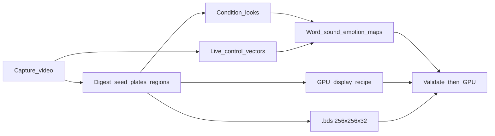

# AminIntheLoop — master design & step-by-step implementation

This is the single source of truth for the walkthrough: **what** we build,
**why**, and **where it lives in code**. Other docs expand pieces; this one
ties them together.

Branch: `AminIntheLoop`  
Substrate: `vendor/nwr` (pinned in `vendor/nwr/NWR_REVISION.txt`)

---

## Product contract (one page)

```text
NWR world = GPU field of cells (each cell = 32 floats).
Objects   = related cell clusters (not separate meshes).
Digest    = learn cell properties + how the GPU displays that look.
Video     = already has motion truth → convert to live control vectors.
Runtime   = same GPU recipe, driven by words/tables + ML cover.
Identity  = immutable photo + Master Lock (ch 31). Never invent face RGB / teeth.
```



---

## Step-by-step design → implementation

### Step 1 — What is NWR?

| | |
| --- | --- |
| **Design** | Neural World Runtime: AI proposes commands → runtime validates → GPU executes on a field of cells. |
| **Code** | `vendor/nwr/`, `aiface.runtime` (field, commands, shaders, `.bds`) |
| **Docs** | This file, `Architecture.md`, README |

### Step 2 — 32 floats per cell

| | |
| --- | --- |
| **Design** | Every cell carries kinematics / material / intent / rules. Channel 31 = Master Lock. |
| **Code** | `amin_loop.cells`, `aiface.runtime.bds.CHANNEL_SCHEMA` |
| **Docs** | `BDSMotionMap.md`, `AvatarCellDataflow.md` Stage B |

| Group | Channels | Face job |
| --- | --- | --- |
| Kinematics 0–7 | velocity, density, pressure, … | Soft tissue ±4 impulses |
| Material 8–15 | albedo RGB, opacity, … | Photo identity |
| Intent 16–23 | attraction, growth, … | Future / sparse today |
| Rules 24–31 | hard_surface, priority, **human_lock** | Who may write |

### Step 3 — Control + neighbor relations

| | |
| --- | --- |
| **Design** | Commands are validated (speed/radius/grid). Neighbors define region connectivity (Moore / 4-connected). The integrated field velocity (ch 0/1) must reach the pixels, not stay telemetry. |
| **Code** | `amin_loop.control` → `PaintCommand` (±4 velocity), `neighbor_offsets`; render: `avatar.frag field_displacement` × `field_warp_gain` (recipe) |
| **Docs** | `Architecture.md` command path |

### Step 4 — Digest image/video → regions

| | |
| --- | --- |
| **Design** | Frontal take → locked identity rest + real smile/open/surprise plates. Regions = connected matter clusters. |
| **Code** | `amin_loop.digest` → `aiface.capture.run_capture_from_video` |
| **Artifacts** | `avatar_face.bds`, `source_face.png`, `open.png`, `smile.png`, `surprise.png`, `capture_meta.json` |
| **Docs** | `AvatarCapture.md` |

### Step 5 — Relations in x, y, (z), t

| | |
| --- | --- |
| **Design** | Cells live on a **2D grid**. Z is an optional **signal channel**, not a voxel axis. Time comes from video / speech clock. |
| **Code** | `amin_loop.regions` (clusters split by Master Lock) |
| **Artifacts** | `region_catalog.json` |

### Step 6 — Condition looks + word / sound / emotion maps

| | |
| --- | --- |
| **Design** | Known visemes/emotions → tables. Looks are **real frames** (plates), not invented RGB. |
| **Code** | `amin_loop.mapping`, `aiface.plates`, `aiface.speech`, `aiface.biomechanics.intent` |
| **Artifacts** | `condition_maps.json`, plate atlas, expression catalog |
| **Runtime** | Visemes own **jaw timing**; HAPPY / smile width drives `smile.png`; open vowels drive `open.png` |

### Step 7 — Learn 32 props in detail per region

| | |
| --- | --- |
| **Design** | Per region: mean of 32 channels, lock fraction, z-signal, cell count. Full grid stays in `.bds` (not duplicated in JSON). The mouth **object** is the seed's high-permeability motion flesh — "not Master-Locked" alone is not an address (background and cheeks are unlocked too, and clustering on lock state merged the mouth into a half-grid blob). |
| **Code** | `amin_loop.regions.digest_regions_from_grid` (`identity` / `mouth_unlocked` = unlocked ∧ permeability ≥ 0.5 / `unlocked_other`); runtime feeds impulses at that object's centroid via `app._mouth_center_from_regions` — the address survives digest → play. |
| **Store** | See `AMIN_DATA_STORE.md` |

### Step 8 — GPU display recipe (the catch)

| | |
| --- | --- |
| **Design** | Digestion must learn **how the GPU shows** a look: textures, tissue maps, jaw/muscle uniforms, plate blend — same path at playback. |
| **Code** | `aiface.runtime.recipe` (single source of truth), `amin_loop.gpu_recipe` (serialize), `aiface/shaders/avatar.frag` (`avatar_recipe` uniform), `aiface.app._update_avatar_uniforms` (load + drive) |
| **Artifacts** | `gpu_display_recipe.json` (real knobs — loaded back at play, not prose) |

Display path (order matters):

1. Identity photo + tissue warp (muscles + jaw)  
2. **Capture plates** `open.png` / `smile.png` over mouth matte (must be visible — not gap-gated only)  
3. Optional cavity fill when jaw actually parts  
4. Atlas plate memory (finer visemes)  
5. Upper-face expression plate (surprise)  
6. Master Lock rejects illegal cell writes  

### Step 9 — Video → live control vectors

| | |
| --- | --- |
| **Design** | Video truth → `[openness_n, jaw_n, width_n]` over time → train audio→vector model. ML covers **unknowns**; tables cover known words. |
| **Code** | `amin_loop.live_vectors` → `aiface.live_vector` (extract / train / driver) |
| **Artifacts** | `live_vector_trajectory.json`, `live_vector_dataset.npz`, `live_vector_model.joblib` |
| **Docs** | `LiveControlVectors.md`, `FROM_SCRATCH_LIVE_VECTOR.md` |

### Step 10 — Document + train + play

| | |
| --- | --- |
| **Design** | One pipeline writes the world set; runtime loads recipe + model; demo speaks. |
| **Code** | `amin_loop.pipeline.run_all_steps`, `scripts/amin_train.py`, `amin-train` entry, `aiface --demo` |
| **Manifest** | `amin_loop_report.json`, `amin_data_store.json` |

```powershell
pip install -e ".[ml,voice]"
python scripts/amin_train.py --video assets/avatar_video_inputs/YOUR.mp4
aiface --demo --tts --world output/worlds/avatar/avatar_face.bds
```

---

## Realism track — steps 11–14 (11, 12 + data-verification built)

Steps 1–10 make the loop *correct*; they say nothing about the *fidelity* of
the looks. Today the whole display chain is pinned to the 256² cell grid
(`analyze_frame` normalizes to `GRID_WIDTH×GRID_HEIGHT`, plates and
`source_face.png` are saved at 256², `app.py` uploads at grid size), so a
1280×720 take renders through 256² textures on a 1024² window. That — plus
plate cross-fades that mix two mouth photos at 50/50 — is the mouth blur.

### Step 11 — Native-resolution display plane

| | |
| --- | --- |
| **Design** | The field stays 256×256×32 (physics + Master Lock authority). Display textures (photo, open/smile/surprise, atlas plates) are captured and uploaded at native face-crop resolution (1024²), registered to the same face box so grid-space warp coordinates are unchanged. |
| **Code** | **Built.** `aiface.capture.resample_frames_hires` (re-cuts selected frames at `DISPLAY_SIZE=1024` via stored `frame_index`; the deterministic face-square crop keeps registration), `write_capture_bundle(hires=...)` (hi-res portrait + plates), `aiface.app` uploads at native size — photo mipmapped 8-bit, part ids split into a grid-res NEAREST `avatar_part_ids` texture (ids in the photo's alpha forced NEAREST + no mips on both). |
| **Rule** | Still real pixels only. Never a neural upscaler on the face (non-goal: generative RGB). |

### Step 12 — Plate compositing sharpness

| | |
| --- | --- |
| **Design** | A 50/50 blend of two mouth photos looks like motion blur. At high sharpness, speech snaps to a **single** plate (`mix=0`); open/smile drives stay mostly-off or mostly-on. |
| **Code** | **Built.** `DisplayRecipe.plate_sharpness` (default **0.90**) → hard snap when ≥0.75 via `PlateAtlas.pair_for_viseme` / `pair_for_openness`; shader still steepens open/smile drives. |
| **Compositing fixes** | Color-match at digest; cavity bows out to the open plate (6 warp iters). Residual soft veil: mute smile under open, `smile_open_overlap=1.0`, hard-snap plate *amount*, hold last speaking viseme while jaw/open elevated, atlas strength → 1.0 when speaking, plate textures LINEAR without mipmaps. |

### Step 13 — Denser viseme plate bank

| | |
| --- | --- |
| **Design** | One real keyframe per canonical viseme, chosen by landmark match from the take — every sound shows the actual video mouth, not an interpolation between 8 openness bins. Take openness span still bounds how wide the jaw can look. |
| **Code** | **Built.** `aiface.plates.select_viseme_atlas_frames` → `viseme_to_plate` in `plate_atlas.json` (up to 16 unique plates at `DISPLAY_SIZE=1024`); runtime prefers viseme→plate over eased openness. |

### Step 14 — Ground-truth playback check

| | |
| --- | --- |
| **Design** | "Looks like the exact video" must be measured: re-render the training script, compare mouth landmarks / SSIM around the mouth against the source frames, report a score per viseme. Tune recipe knobs against the score, not by eye. |
| **Code** | **Data half built:** `scripts/verify_world.py` scores every digested artifact PASS/WARN/FAIL — capture selection contrast (smile/open vs rest), display resolution, plate atlas coverage, Master Lock layout, mouth-object address vs seed, live-vector dataset (label spans, audio↔openness correlation), model vs baseline, condition maps, recipe schema. Playback half (re-render + landmark/SSIM) still open: `scripts/verify_playback.py`. |

---

## Runtime authority (who drives what)

| Signal | Authority | Must not |
| --- | --- | --- |
| Jaw open/close timing | **Viseme / word table** | Flap from raw RMS energy |
| Open look | Viseme openness → `open.png` overlay | Stay invisible behind gap gate |
| Smile look | HAPPY and/or live `width_n` → `smile.png` | Zero for all NEUTRAL forever |
| Unknown sounds | Live-vector ML cover | Rewrite identity albedo |
| Field tissue motion | NWR velocity ch 0/1 × `field_warp_gain` (lock-gated) | Stay telemetry-only |
| Identity cells | Master Lock ch 31 | Path A ownership seals |

---

## How we save “that much” data

Full detail: [`AMIN_DATA_STORE.md`](AMIN_DATA_STORE.md).

| Store once | Compact side-cars |
| --- | --- |
| `.bds` ≈ 8 MB (all cells × 32 floats) | region means, condition maps, GPU recipe, live vectors, plates |

We do **not** save a full grid per video frame.

---

## Package map

```text
vendor/nwr/                 NWR substrate (pinned)
src/amin_loop/
  cells.py                  Step 2
  control.py                Step 3
  digest.py                 Step 4
  regions.py                Steps 5–7
  mapping.py                Step 6
  gpu_recipe.py             Step 8
  live_vectors.py           Step 9
  pipeline.py / cli.py      Step 10
  store.py                  Data manifest
src/aiface/
  runtime/                  Field, .bds, commands, shaders
  capture.py                Digest take → plates
  live_vector/              Extract / train / driver
  app.py                    Window + uniforms + authority
  mouth_owner.py            NWR-first status (no Path A seals)
  shaders/avatar.frag       GPU display recipe
scripts/amin_train.py       One-command train
docs/                       This design set (see docs/README.md)
```

---

## Bugs we hit (do not reintroduce)

| Bug | Symptom | Fix |
| --- | --- | --- |
| Path A ownership seals | Mouth frozen / zipped | Removed; Master Lock only |
| Plate ×0.18 warp damp | Motion with sealed lips | Jaw undamped; smile damp only |
| Open/smile only in jaw gap | Capture looks invisible | Direct plate overlay in shader |
| Jaw from RMS energy | Jaw flaps off words | Visemes own jaw |
| Tiny mouth mattes | Plates barely visible | Wider expression mattes |

---

## Non-goals (permanent)

- Generative face RGB / morph rewriting identity  
- Invented enamel / dark fake teeth as product  
- True 3D voxel face world (Z stays a channel)  
- Path A mouth ownership seals  
- Per-frame full `.bds` dumps from video  

---

## Related docs

Index: [`docs/README.md`](README.md)
