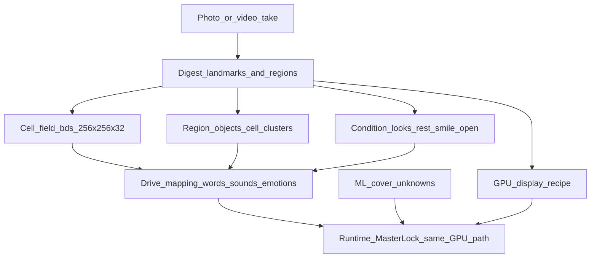

# Avatar digest → cell regions → drive mapping

Master design: [`AMIN_DESIGN.md`](AMIN_DESIGN.md)

## Agreement

An **object** is not a separate mesh. It is a **connected cluster of cells**
with shared roles (lock, soft tissue, plate look) and relations in
**x, y, (z signal), and time**.

```text
Digest teaches cells and looks.
Mapping teaches words / sounds / emotions.
Runtime validates (Master Lock).
ML covers holes.
Identity albedo stays locked.
Capture open/smile plates must actually paint (not gap-gated only).
```

## End-to-end data flow



## Stage A — Digest

**Input:** frontal capture (rest · smile · open · talk · surprise)

**Output:** `.bds`, `source_face.png`, plates, tissue/parts, `region_catalog.json`

## Stage B — 32 properties / cell

See [`BDSMotionMap.md`](BDSMotionMap.md) and [`AMIN_DESIGN.md`](AMIN_DESIGN.md) Step 2.

## Stage C — Region objects

| Region | Relation | Looks |
| --- | --- | --- |
| Identity (locked) | Master Lock ≥ 0.5 | `source_face` only |
| Mouth unlocked | Soft cluster | `open.png` / atlas when open |
| Smile band | Width / HAPPY | `smile.png` |
| Brows / lids | Upper tissue | `surprise.png` |

## Stage D — Drive mapping

```text
word / sound / viseme / emotion
        ↓
  region drives + plate amounts
        ↓
  same GPU recipe
```

- **Tables** for known visemes/emotions  
- **ML** only for unknowns  
- **Jaw** follows words; plates follow open/smile drives  

## Storage

[`AMIN_DATA_STORE.md`](AMIN_DATA_STORE.md)
